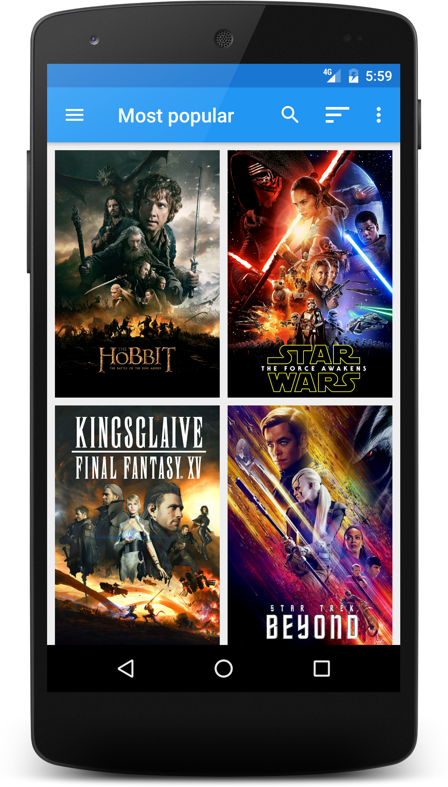
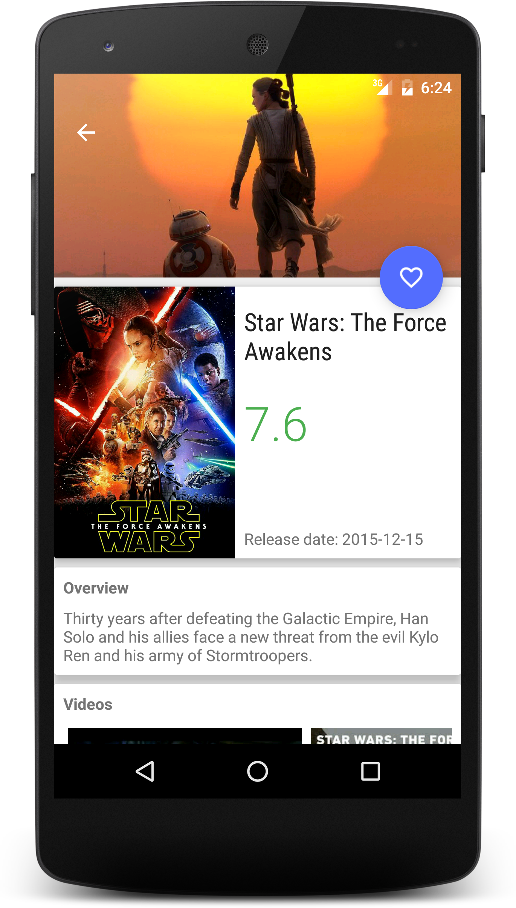
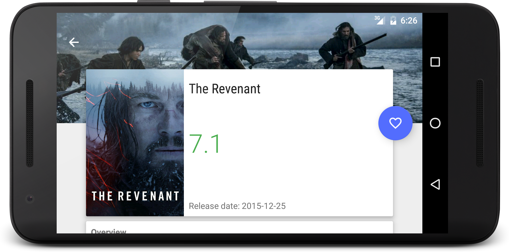
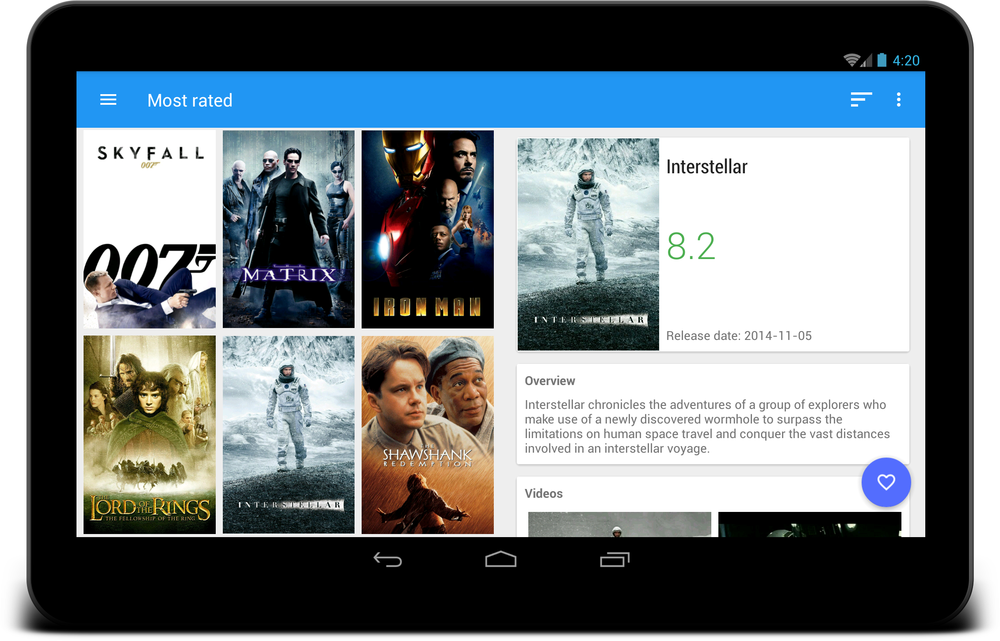

Popular Movies App
==================

A simple Android app, that helps user to discover movies. 

**Features:**

- Discover the most popular, the highest rated and the most rated movies
- Watch movie trailers and teasers
- Read reviews from other users
- Mark movies as favorites
- Search for movies
- Offline work
- Material design
- UI optimized for phone and tablet

**Download:**

Screenshots
-----------

### Testing

This project integrates a combination of [local unit tests][2], [instrumented tests][3] and [code analysis tools][4].

License
-------

    Copyright 2020 Suraj Sahani

    Licensed under the Apache License, Version 2.0 (the "License");
    you may not use this file except in compliance with the License.
    You may obtain a copy of the License at

    http://www.apache.org/licenses/LICENSE-2.0

    Unless required by applicable law or agreed to in writing, software
    distributed under the License is distributed on an "AS IS" BASIS,
    WITHOUT WARRANTIES OR CONDITIONS OF ANY KIND, either express or implied.
    See the License for the specific language governing permissions and
    limitations under the License.

[1]: https://www.themoviedb.org/documentation/api
[2]: app/src/test/
[3]: app/src/androidTest/
[4]: quality/
[5]: https://github.com/maksim-m/Popular-Movies-App/releases
